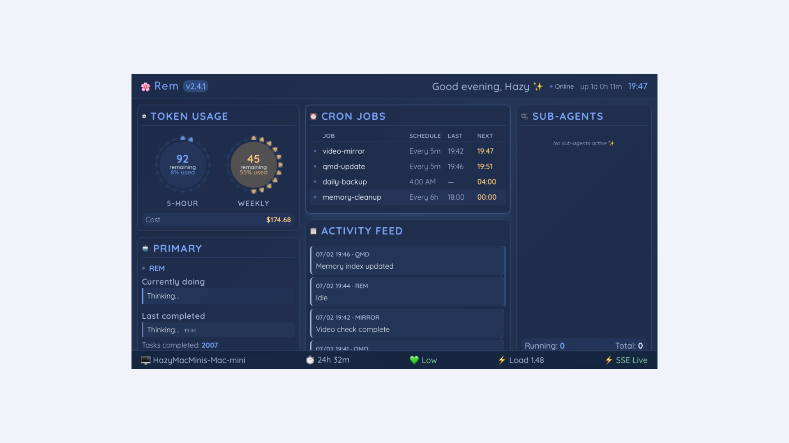

# Rem Dashboard

A native Tauri dashboard for monitoring [OpenClaw](https://github.com/openclaw/openclaw) AI assistants. Designed for small displays (5-inch / 1280×720) on always-on setups like Mac Mini.



## Features

- 🌸 **Token Usage** — Petal visualization for 5-hour and weekly Claude Max limits
- 🤖 **Agent Status** — Real-time primary agent activity with auto-detection
- ⏰ **Cron Jobs** — View launchd scheduled tasks with next run times
- 📋 **Activity Feed** — Color-coded logs via Server-Sent Events (SSE)
- 🫧 **Sub-Agents** — Track spawned background sessions
- 📊 **System Metrics** — Uptime, memory pressure, load average

## Quick Start

### Prerequisites

- Node.js 18+
- Rust (for Tauri)
- macOS (uses launchd, CodexBar)

### Install & Run

```bash
# Install frontend dependencies
npm install

# Install server dependencies
cd server && npm install && cd ..

# Start API server (port 3001)
node server/api.js &

# Run in dev mode
npm run tauri:dev
```

### Build for Production

```bash
npm run tauri:build
```

The app bundle will be in `src-tauri/target/release/bundle/`.

## API Server

The dashboard requires a local API server that:
- Scans OpenClaw session logs for usage data
- Watches session transcripts for auto-activity detection
- Exposes SSE endpoint for real-time updates

```bash
# Log activity from scripts
curl -X POST localhost:3001/api/activity \
  -H "Content-Type: application/json" \
  -d '{"agent":"REM","message":"Task done","type":"success"}'
```

## Configuration

The dashboard reads from:
- `~/.openclaw/agents/main/sessions/*.jsonl` — Session transcripts
- CodexBar CLI — Claude Max usage data
- launchd — Cron job schedules

## Project Structure

```
rem-dashboard/
├── src/                    # React frontend
│   └── rem-dashboard.jsx   # Main dashboard component
├── src-tauri/              # Rust/Tauri backend
├── server/                 # Node.js API server
│   ├── api.js              # Express server + SSE
│   └── usage-scanner.js    # OpenClaw log parser
└── start-dashboard.sh      # Launch script
```

## License

MIT
